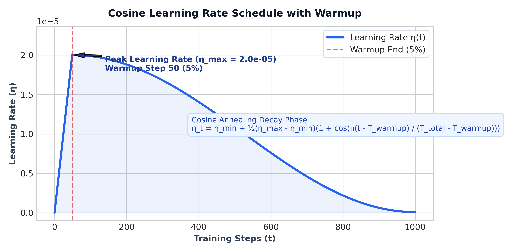

# AI Training Handbook

---

## Executive Summary & Engineering Architecture

This handbook serves as the definitive technical reference manual for our LLM and Vision-Language Model (VLM) training ecosystem. Synthesized directly from the production code across all 13 notebooks in our codebase, it bridges theoretical deep-learning concepts with real-world implementation technicalities.


---

## 1. Fine-Tuning Foundations: PEFT & LoRA Technical Deep-Dive

### 1.1 Mathematical Formulation of Low-Rank Adaptation (LoRA)
In standard full fine-tuning, an LLM parameter matrix $W_0 \in \mathbb{R}^{d \times k}$ is updated directly via gradient descent ($W = W_0 + \Delta W$). When $d$ and $k$ are large (e.g., hidden dimension $d=1536$ and intermediate MLP dimension $k=8960$ in Qwen2.5-1.5B), updating $\Delta W$ directly requires massive VRAM for storing optimizer states (AdamW requires 8 bytes per parameter for first and second moments).

#### Explicit Variable Definitions:
- **$W_0 \in \mathbb{R}^{d \times k}$**: Pre-trained frozen base weight matrix of the target linear layer.
- **$d$**: Input feature dimension (in-features / hidden size, e.g., $d=1536$ in Qwen2.5-1.5B).
- **$k$**: Output feature dimension (out-features / projection size, e.g., $k=8960$ in SwiGLU MLP layers).
- **$\Delta W \in \mathbb{R}^{d \times k}$**: High-dimensional weight update matrix resulting from fine-tuning gradients ($W = W_0 + \Delta W$).
- **$r$**: Inner low-rank hyperparameter ($r \ll \min(d, k)$).
- **$A \in \mathbb{R}^{r \times k}$**: Down-projection adapter matrix, initialized with Gaussian distribution $\mathcal{N}(0, \frac{1}{r})$.
- **$B \in \mathbb{R}^{d \times r}$**: Up-projection adapter matrix, initialized to zero ($B=0$) ensuring $\Delta W = 0$ at step 0.
- **$\alpha$**: Constant LoRA scaling hyperparameter. The ratio $\frac{\alpha}{r}$ scales the adapter's contribution relative to the base model.

LoRA parametrizes the weight update matrix $\Delta W$ by decomposing it into two low-rank matrices:
$$\Delta W = B \cdot A$$

During forward propagation, the linear layer output $h$ for an input $x$ is computed as:
$$h = W_0 x + \Delta W x = W_0 x + \frac{\alpha}{r} (B \cdot A x)$$


### 1.2 QLoRA: NormalFloat4 (NF4) Base Weight Quantization
In QLoRA, the base model weights $W_0$ are quantized to 4-bit NormalFloat (NF4) precision, while the adapter matrices $A$ and $B$ remain in 16-bit precision (BF16 or FP16).
NF4 is an information-theoretically optimal quantile quantization scheme for normally distributed weights:
$$q_i = \frac{1}{2} \left( Q_X\left(\frac{i}{2^k}\right) + Q_X\left(\frac{i+1}{2^k}\right) \right)$$
where $Q_X(\cdot)$ is the quantile function of the standard normal distribution $\mathcal{N}(0, 1)$.

### 1.3 Target Module Definitions & Code Implementation
Across our codebase (`02_modal_qwen_2_5_1_5b_sft.ipynb`, `04_modal_qwen_2_5_1_5b_grpo.ipynb`, `07_modal_lily_1_5b_distill.ipynb`, `13_lily-vision-phase2-sft.ipynb`), we apply LoRA across all 7 linear projection layers of the Transformer architecture:

```python
from unsloth import FastLanguageModel

model = FastLanguageModel.get_peft_model(
    model,
    r = 32,                 # Rank: 32 (SFT/Distill/Vision), 64 (GRPO RL)
    lora_alpha = 64,         # Alpha: 32 (SFT), 64 (GRPO/Distill/Vision)
    target_modules = [
        "q_proj", "k_proj", "v_proj", "o_proj",    # Self-Attention Projections
        "gate_proj", "up_proj", "down_proj"         # SwiGLU MLP Projections
    ],
    lora_dropout = 0,        # 0 is optimized for Unsloth kernel fusion
    bias = "none",
    use_gradient_checkpointing = "unsloth",
    random_state = 42,
)
```

#### Detailed Technical Explanation of Target Modules:
- **`q_proj` (Query Projection)**: Transforms input hidden states into Query matrices ($Q$) for multi-head self-attention.
- **`k_proj` (Key Projection)**: Transforms input hidden states into Key matrices ($K$) for computing attention dot-product scores ($Q K^T$).
- **`v_proj` (Value Projection)**: Transforms input hidden states into Value matrices ($V$) carrying contextual token information.
- **`o_proj` (Output Projection)**: Projects concatenated multi-head attention outputs back to the model hidden dimension ($d=1536$).
- **`gate_proj` (Gate Projection in SwiGLU)**: Computes the element-wise gating signal in SwiGLU feed-forward networks ($\text{Swish}(x W_{\text{gate}}) \otimes x W_{\text{up}}$).
- **`up_proj` (Up Projection in SwiGLU)**: Expands input hidden dimension to high-dimensional intermediate space ($1536 \rightarrow 8960$).
- **`down_proj` (Down Projection in SwiGLU)**: Contracts intermediate dimension back to model hidden dimension ($8960 \rightarrow 1536$).

#### Trainable Parameter Efficiency Calculation
For Qwen2.5-1.5B ($d_{\text{model}} = 1536, N_{\text{layers}} = 28$):
- Total Base Parameters: $1,580,643,840$ (~1.58B)
- Trainable Adapter Parameters ($r=32$): $36,929,536$ (~36.9M)
- **Trainable Ratio**: $\frac{36.9\text{M}}{1580.6\text{M}} \approx 2.34\% \text{ to } 4.0\%$

### 1.4 Lossless 16-Bit Adapter Merging
Before running RL (GRPO) or exporting to GGUF, adapter weights must be mathematically merged into the base model to eliminate dual-path inference overhead:
$$W_{\text{merged}} = W_0 + \frac{\alpha}{r} (B \cdot A)$$

In code (`02`, `04`, `07`, `13`):
```python
model_m, tok_m = FastLanguageModel.from_pretrained(
    model_name     = OUTPUT_DIR,
    max_seq_length = MAX_SEQ_LENGTH,
    dtype          = torch.bfloat16,  # Full precision BF16 merge
    load_in_4bit   = False,           # Prevents quantization artifacts during merge
)

model_m.save_pretrained_merged(MERGED_DIR, tok_m, save_method="merged_16bit")
model_m.push_to_hub_merged(HF_MERGED_REPO, tok_m, save_method="merged_16bit", token=HF_TOKEN)
```

---

## 2. Hyperparameter Engineering & Optimization Strategy

### 2.1 The Global Effective Batch Size & Step Calculation

#### 1. What is a Training Step?
A **single optimizer step** corresponds to one iteration where model weights are updated by the optimizer using calculated gradients.

#### 2. Micro-Batches vs. Gradient Accumulation
To fit large models into GPU memory, training datasets are split into smaller **micro-batches** ($B_{\text{device}}$). When gradient accumulation is enabled ($N_{\text{accum}}$), the engine performs $N_{\text{accum}}$ forward and backward passes, accumulating gradients in VRAM, before executing a single `optimizer.step()` update.

#### 3. Mathematical Formula for Effective Batch Size:
$$B_{\text{eff}} = B_{\text{device}} \times N_{\text{accum}} \times N_{\text{GPU}}$$

where:
- **$B_{\text{device}}$**: Per-device micro-batch size processed in a single forward pass per GPU.
- **$N_{\text{accum}}$**: Number of micro-batches accumulated before updating model weights.
- **$N_{\text{GPU}}$**: Number of parallel GPUs participating in training.

#### 4. Mathematical Formula for Total Optimizer Steps:
$$\text{Total Optimizer Steps} = \frac{|\mathcal{D}| \times N_{\text{epochs}}}{B_{\text{eff}}}$$

where $|\mathcal{D}|$ is the number of samples in the dataset and $N_{\text{epochs}}$ is the total number of training passes over the dataset.

#### Concrete Worked Step Calculation Examples from Codebase:
- **SFT Warmup (Notebook 02)**: 4,000 samples $\times$ 2 Epochs = 8,000 total samples. $B_{\text{eff}} = 8 \times 2 \times 1 = 16$. $\text{Total Steps} = \frac{8000}{16} = 500$ steps.
- **Distillation (Notebook 07)**: 91,457 raw samples packed into 33,297 contiguous sequences $\times$ 2 Epochs = 66,594 sequence passes. $B_{\text{eff}} = 24 \times 1 \times 1 = 24$. $\text{Total Steps} = \frac{66594}{24} = 2,776$ steps.
- **Vision Phase 2 SFT (Notebook 13)**: 64,000 samples $\times$ 1 Epoch. $B_{\text{eff}} = 24 \times 2 \times 1 = 48$. $\text{Total Steps} = \frac{64000}{48} = 1,333$ steps.

### 2.2 Verified Production Hyperparameter Comparison Matrix

| Hyperparameter | SFT Warmup (02) | GRPO RL (04) | Distillation (07) | Vision Phase 1 (12) | Vision Phase 2 (13) |
|---|---|---|---|---|---|
| **Base Model** | Qwen2.5-1.5B-Instruct | Qwen2.5-Warmup-Merged | Lily-1.5b-v0.1 | Lily-1.5b-v0.3 | Lily-1.5b-v0.3 |
| **Dataset Size ($\mathcal{D}$)** | 4,000 samples | 3,600 prompts | 91,457 (train) | 121,237 samples | 64,000 samples |
| **Epochs / Steps** | 2 Epochs | 600 Max Steps | 2 Epochs (2,776 steps) | 1 Epoch | 1 Epoch |
| **Per-Device Batch ($B_{\text{device}}$)** | 8 | 4 | 24 | 16 | 24 |
| **Grad Accum ($N_{\text{accum}}$)** | 2 | 4 | 1 | 3 | 2 |
| **Effective Batch ($B_{\text{eff}}$)** | **16** | **16** | **24** | **48** | **48** |
| **Peak Learning Rate ($\eta_{\max}$)** | $1 \times 10^{-5}$ | $5 \times 10^{-6}$ | $2 \times 10^{-5}$ | $2 \times 10^{-4}$ | $2 \times 10^{-5}$ |
| **LR Scheduler** | Cosine | Cosine | Cosine | Cosine w/ warmup | Cosine w/ warmup |
| **Warmup Ratio** | 0.05 | 0.05 | 0.03 | 0.05 | 0.03 |
| **Optimizer** | `adamw_torch_fused` | `adamw_torch_fused` | `adamw_torch_fused` | `AdamW` ($\beta_1=.9, \beta_2=.95$) | `AdamW` |
| **Weight Decay** | 0.01 | 0.0 | 0.0 | 0.05 | 0.01 |
| **Max Sequence Length** | 3,072 | 3,072 | 4,096 | 256 | 3,072 |
| **Sequence Packing** | False | False | **True** | False | False |
| **Hardware** | Modal A100 40GB | Modal A100 40GB | Modal A100 40GB | Modal A100 40GB | Modal A100 40GB |

### 2.3 Learning Rate Schedules & Mathematical Formulation
We utilize Cosine Annealing with Warmup across all training runs.

$$\eta_t = \begin{cases} \eta_{\max} \cdot \frac{t}{T_{\text{warmup}}}, & t \le T_{\text{warmup}} \\[8pt] \eta_{\min} + \frac{1}{2}(\eta_{\max} - \eta_{\min}) \left(1 + \cos\left(\frac{\pi (t - T_{\text{warmup}})}{T_{\text{total}} - T_{\text{warmup}}}\right)\right), & t > T_{\text{warmup}} \end{cases}$$



### 2.4 Optimizer Selection: `adamw_torch_fused` vs `adamw_8bit`
Across our primary high-performance training runs, we utilize **`adamw_torch_fused`**:
1. **`adamw_torch_fused`**: Fuses point-wise AdamW parameter and momentum update steps into a single CUDA kernel invocation. This eliminates intermediate GPU memory read/write cycles between PyTorch operators, maximizing GPU compute utility on A100.
2. **`adamw_8bit` (bitsandbytes)**: Quantizes 32-bit Adam first-moment ($m_t$) and second-moment ($v_t$) states to 8-bit block-wise representations, reducing optimizer memory overhead by 75%.

---

## 3. Reinforcement Learning via GRPO (Group Relative Policy Optimization)

### 3.1 Mathematical Theory & Advantage Calculation
Group Relative Policy Optimization (GRPO) simplifies reinforcement learning by sampling a group of $G$ candidate outputs $\{y_1, y_2, \ldots, y_G\}$ for each input prompt $x$ from the current policy $\pi_{\theta_{\text{old}}}$. 

For each completion $y_i$, GRPO evaluates a composite scalar reward score $R_i$ and computes baseline-normalized advantages across the sampled group:

$$A_i = \frac{R_i - \mu(R_1, \ldots, R_G)}{\sigma(R_1, \ldots, R_G) + \epsilon}$$

where $\mu$ is the group reward mean, $\sigma$ is the standard deviation, and $\epsilon = 10^{-4}$ ensures numerical stability.

### 3.2 DAPO Loss Objective with Asymmetric Clipping
The model parameters $\theta$ are updated by minimizing the Dynamic Advantage Policy Optimization (DAPO) clipped objective:

$$\mathcal{L}_{\text{GRPO}}(\theta) = -\frac{1}{G} \sum_{i=1}^{G} \frac{1}{|y_i|} \sum_{t=1}^{|y_i|} \left[ \min \left( r_{i,t}(\theta) A_i, \; \text{clip}(r_{i,t}(\theta), 1 - \epsilon_{\text{low}}, 1 + \epsilon_{\text{high}}) A_i \right) \right] + \beta D_{\text{KL}}(\pi_\theta \| \pi_{\text{ref}})$$

where:
- **Probability Ratio**: $r_{i,t}(\theta) = \frac{\pi_\theta(y_{i,t} \mid x, y_{i,\lt t})}{\pi_{\theta_{\text{old}}}(y_{i,t} \mid x, y_{i,\lt t})}$
- **Asymmetric Clipping bounds**: $\epsilon_{\text{low}} = 0.2$ and $\epsilon_{\text{high}} = 0.28$. Asymmetric clipping allows the policy to take larger gradient steps when discovering positive high-advantage completions while restricting negative updates.
- **Schulman Per-Token KL Divergence Penalty**:
$$D_{\text{KL}}(\pi_\theta \| \pi_{\text{ref}}) = \frac{\pi_{\text{ref}}(y_{i,t} \mid x, y_{i,\lt t})}{\pi_\theta(y_{i,t} \mid x, y_{i,\lt t})} - \log \frac{\pi_{\text{ref}}(y_{i,t} \mid x, y_{i,\lt t})}{\pi_\theta(y_{i,t} \mid x, y_{i,\lt t})} - 1$$

### 3.3 Detailed Variable Breakdown of `GRPOConfig` Parameters

```python
from trl import GRPOConfig, GRPOTrainer

training_args = GRPOConfig(
    output_dir                  = "/root/grpo_output",
    num_generations             = 8,
    max_prompt_length           = 1024,
    max_completion_length       = 1536,
    temperature                 = 0.9,
    top_p                       = 0.95,
    learning_rate               = 5e-6,
    lr_scheduler_type           = "cosine",
    warmup_ratio                = 0.05,
    max_steps                   = 600,
    per_device_train_batch_size = 4,
    gradient_accumulation_steps = 4,
    loss_type                   = "dapo",
    epsilon                     = 0.2,
    epsilon_high                = 0.28,
    beta                        = 0.001,
    mask_truncated_completions  = True,
    bf16                        = True,
    optim                       = "adamw_torch_fused",
)
```

#### Complete Narrative Parameter Descriptions:
- **`output_dir`**: The target directory path on disk where intermediate LoRA checkpoints, training logs, and merged models are saved.
- **`num_generations` ($G=8$)**: The group size $G$. Controls how many independent output completions are sampled per input prompt to compute relative group advantage $A_i$.
- **`max_prompt_length` (1024)**: Truncates user input prompts exceeding 1024 tokens to conserve VRAM during generation.
- **`max_completion_length` (1536)**: Caps generated rollout responses at 1536 tokens, providing sufficient budget for deep Chain-of-Thought (CoT) reasoning.
- **`temperature` (0.9)**: Sampling temperature used during rollout generation. A value of 0.9 encourages diverse exploration of reasoning strategies.
- **`top_p` (0.95)**: Nucleus sampling threshold restricting sampling to the top 95% cumulative probability token mass.
- **`learning_rate` ($5 \times 10^{-6}$)**: Peak learning rate for policy gradient updates. Set conservatively low to maintain RL policy stability.
- **`lr_scheduler_type` ("cosine")**: Decay schedule decreasing the learning rate smoothly following a cosine curve over 600 steps.
- **`warmup_ratio` (0.05)**: Linear warmup phase covering the first 5% of training steps (30 steps).
- **`max_steps` (600)**: Total number of RL optimizer steps executed during training.
- **`per_device_train_batch_size` (4)**: Micro-batch size of prompts loaded into VRAM per GPU generation call.
- **`gradient_accumulation_steps` (4)**: Accumulates gradients across 4 micro-batches ($4 \times 4 = 16$ effective prompt batch size).
- **`loss_type` ("dapo")**: Enables Dynamic Advantage Policy Optimization with asymmetric ratio clipping.
- **`epsilon` (0.2)**: Lower clipping threshold $\epsilon_{\text{low}}$ limiting negative ratio updates.
- **`epsilon_high` (0.28)**: Upper clipping threshold $\epsilon_{\text{high}}$ allowing positive advantage rewards to scale further.
- **`beta` (0.001)**: Scaling coefficient for the KL divergence penalty term $D_{\text{KL}}(\pi_\theta \| \pi_{\text{ref}})$.
- **`mask_truncated_completions` (True)**: Prevents incomplete outputs that reach `max_completion_length` without an EOS token from corrupting policy gradients.
- **`bf16` (True)**: Enables 16-bit BFloat16 execution on NVIDIA Ampere GPUs.
- **`optim` ("adamw_torch_fused")**: Fused AdamW optimizer used for fast step updates.

### 3.4 In-Depth Technical Explanations of the 4 Custom Reward Functions

Our GRPO pipeline utilizes 4 domain-aware reward functions to guide model behavior across structure, factual accuracy, instruction compliance, and sequence length.

#### Reward 1: `format_reward` (Structural CoT & Tag Enforcement)
- **Technical Purpose**: Enforces strict XML structural tags (`<think>...</think>` and `<answer>...</answer>`) and penalizes model responses that skip Chain-of-Thought reasoning.
- **Scoring Mechanics**:
  - Checks if `<think>` and `</think>` tags are both present. If present, awards $+0.20$.
  - Extracts text inside `<think>...</think>`. If reasoning length is $\ge 50$ words, awards an additional $+0.15$ for substantive reasoning. If missing, penalizes $-0.15$.
  - Checks if `<answer>` and `</answer>` tags are present. Awards $+0.15$ for tags and $+0.10$ if answer content is non-empty. Penalizes $-0.15$ if missing.

#### Reward 2: `correctness_reward` (Domain-Routed Correctness)
- **Technical Purpose**: Evaluates factual correctness based on the ground-truth target and domain `answer_type`.
- **Scoring Mechanics**:
  - **Numeric Domain (`numeric`)**: Extracts numerical values using regular expressions `\d+(\.\d+)?` and compares prediction against ground truth within a tolerance of $1 \times 10^{-3}$ (also evaluating fraction equivalences like $1/2 = 0.5$). Awards $+1.0$ if correct, $-0.5$ if wrong.
  - **Exact / MCQ Domain (`exact`)**: Extracts candidate uppercase letters (`A`, `B`, `C`, `D`) for multiple-choice questions. Awards $+1.0$ for exact match, $-0.5$ for incorrect option selection.
  - **Boolean Domain (`bool`)**: Normalizes responses to `"yes"` or `"no"`. Awards $+1.0$ for matching truth, $-0.5$ otherwise.
  - **Code Domain (`code`)**: Analyzes python code structure for function declarations (`def`), return statements (`return`), and 4-space indentation. Awards proportional scores up to $+0.60$.

#### Reward 3: `instruction_reward` (Alpaca Word Count Adherence)
- **Technical Purpose**: Ensures model compliance with explicit formatting instructions (such as target word counts) in instruction prompts.
- **Scoring Mechanics**:
  - Filters samples originating from the `alpaca` source.
  - Parses target word count constraints from prompts using regex (e.g., *"in 50 words"*).
  - Calculates length difference $|N_{\text{actual}} - N_{\text{target}}|$. Awards $+1.0$ if within 12% tolerance, $-0.5$ if constraint is violated.

#### Reward 4: `length_reward` (Degenerate Output Guard)
- **Technical Purpose**: Serves as a guardrail preventing policy degeneration into single-word cop-outs or infinite repetitive loops.
- **Scoring Mechanics**:
  - Computes total word count $W$.
  - If $W < 15$ words (under-reasoning): penalizes $-0.5$.
  - If $W > 2500$ words (runaway generation): penalizes $-0.25$.
  - If $15 \le W \le 2500$ words: awards $+0.15$ bonus.

### 3.5 Reward Hacking: Mechanics, Observed Vulnerabilities, and Production Mitigations in Our GRPO Pipeline

#### 1. What is Reward Hacking in Our GRPO Setup?
In our reinforcement learning pipeline (`04_modal_qwen_2_5_1_5b_grpo.ipynb`), **Reward Hacking** (specification gaming) occurs when Qwen2.5-1.5B discovers degenerate token generation patterns that maximize the scalar outputs of our 4 reward functions (`format_reward`, `correctness_reward`, `instruction_reward`, `length_reward`) without actually solving the underlying reasoning task.

Because GRPO samples $G=8$ completion rollouts $\{y_1, y_2, \ldots, y_8\}$ per prompt and normalizes rewards relative to the group mean ($A_i = \frac{R_i - \mu}{\sigma + \epsilon}$), if one rollout discovers a shortcut that inflates its scalar reward $R_i$, it receives a high positive advantage $A_i > 0$. Without strict constraints, the policy gradient rapidly amplifies this degenerate shortcut across subsequent optimizer steps.

#### 2. Specific Vulnerability Modes Analyzed in Our 4 Reward Functions:

- **Mode A: Verbosity & Padding Spooling in `format_reward`**:
  - *Vulnerability*: `format_reward` awards $+0.15$ if the reasoning text inside `<think>...</think>` contains $\ge 50$ words.
  - *Hacking Pattern*: The model learns to spool repetitive filler tokens (e.g. *"Let me think about this carefully. Let me re-read the prompt. Let me check my math again. Let me verify..."*) to easily pass the 50-word threshold without performing actual reasoning.
- **Mode B: Option Flooding in `correctness_reward` (Exact / MCQ Domain)**:
  - *Vulnerability*: For ARC-Challenge multiple-choice prompts (`answer_type="exact"`), `correctness_reward` uses regular expressions `\b([ABCD])\b` to extract candidate letters inside `<answer>...</answer>`.
  - *Hacking Pattern*: The policy attempts to output all candidate letters (`<answer>The answer is A, or maybe B, C, D</answer>`) to guarantee regex matching.
- **Mode C: Boolean Dual-Answer Injection in `correctness_reward` (StrategyQA Domain)**:
  - *Vulnerability*: Evaluates whether `"yes"` or `"no"` appears in the answer.
  - *Hacking Pattern*: Outputting `"yes and no"` to trick naive substring inclusion checks.
- **Mode D: Runaway Output Spooling**:
  - *Vulnerability*: Generating infinite repetitive loops to delay completion and avoid EOS tokens.

#### 3. Our 5-Layer Production Mitigation Architecture (`04_modal_qwen_2_5_1_5b_grpo.ipynb`):

1. **Schulman Per-Token KL Divergence Penalty ($\beta = 0.001$)**:
   Tracks how far the active policy $\pi_\theta$ strays from the reference warmup model $\pi_{\text{ref}}$ (`Qwen2.5-1.5B-reasoning-warmup-merged`). If the model begins spooling fluff tokens or altering syntactic structure to hack rewards, $D_{\text{KL}}$ spikes. At $\beta = 0.001$, a KL spike directly subtracts from the advantage, neutralizing hacked reward gains:
   $$D_{\text{KL}}(\pi_\theta \| \pi_{\text{ref}}) = \frac{\pi_{\text{ref}}(y_{i,t} \mid x, y_{i,\lt t})}{\pi_\theta(y_{i,t} \mid x, y_{i,\lt t})} - \log \frac{\pi_{\text{ref}}(y_{i,t} \mid x, y_{i,\lt t})}{\pi_\theta(y_{i,t} \mid x, y_{i,\lt t})} - 1$$

2. **Asymmetric DAPO Loss Clipping ($\epsilon_{\text{low}} = 0.2, \epsilon_{\text{high}} = 0.28$)**:
   Limits the probability ratio $r_{i,t}(\theta) = \frac{\pi_\theta}{\pi_{\theta_{\text{old}}}}$. Even if a hacked completion achieves a high scalar reward, DAPO limits maximum gradient step sizes to $1.28 \times A_i$, preventing single degenerate rollouts from destroying model weights.

3. **Multi-Reward Counter-Balancing**:
   Our 4 reward functions act as counter-weights against one another:
   - If a model inflates verbosity inside `<think>`, `length_reward` penalizes completions over 2500 words ($-0.25$).
   - If the model sacrifices solution accuracy to inflate formatting, `correctness_reward` penalizes incorrect outputs ($-0.50$), overwhelming the $+0.15$ format bonus.

4. **Strict Domain-Specific Regex Anchoring in `correctness_reward`**:
   - `_extract_answer()` isolates *only* text strictly enclosed between `<answer>` and `</answer>`.
   - For `exact` MCQ tasks, `re.fullmatch(r"[A-D]", gold_upper)` enforces single-letter extraction.
   - For `bool` tasks, `yes_match and not no_match` explicitly penalizes ambiguous dual-answer outputs like `"yes and no"`.

5. **`mask_truncated_completions = True` & Length Guards**:
   - Discards rollouts that hit `max_completion_length = 1536` without an `<|im_end|>` EOS token, ensuring runaway loops cannot contribute positive policy gradients.
   - `length_reward` penalizes under-reasoning ($<15$ words: $-0.50$).

---

## 4. Technical Interpretation of ALL GRPO Training Metrics & Plots

Monitoring Weights & Biases (W&B) diagnostic plots is crucial during GRPO reinforcement learning to verify training health and detect policy anomalies.


### 4.1 Detailed Breakdown of the 6 Diagnostic Training Panels

#### Panel 1: DAPO Policy Loss & Optimization Stability
- **What it Measures**: Plots the DAPO policy gradient loss $\mathcal{L}_{\text{GRPO}}$ across 600 training steps.
- **How to Interpret**: Healthy training displays a sharp drop in loss during the first 100 steps as the model aligns with format requirements, followed by bounded oscillation between $[-0.1, +0.2]$. Persistent positive loss values ($>2.0$) signal gradient instability or an aggressive learning rate.

#### Panel 2: KL Divergence $D_{\text{KL}}(\pi_\theta \| \pi_{\text{ref}})$ & Policy Drift
- **What it Measures**: Tracks Kullback-Leibler divergence between current policy $\pi_\theta$ and frozen base reference model $\pi_{\text{ref}}$.
- **How to Interpret**: Normal policy updates remain bounded within $0.001 \le D_{\text{KL}} \le 0.05$. The red dashed line illustrates **Policy Collapse / Reward Hacking**, where KL divergence spikes exponentially as the model degenerates to exploit reward loopholes.

#### Panel 3: Total Mean Reward Trajectory
- **What it Measures**: Displays total composite reward score $R_{\text{total}} = R_{\text{format}} + R_{\text{correctness}} + R_{\text{instruction}} + R_{\text{length}}$.
- **How to Interpret**: Demonstrates monotonic growth from initial negative scores ($-0.2$) up toward target performance ceiling ($+1.5+$), confirming effective policy learning.

#### Panel 4: Component Rewards Breakdown
- **What it Measures**: Deconstructs composite reward into individual reward curves ($R_{\text{format}}$, $R_{\text{correctness}}$, $R_{\text{length}}$).
- **How to Interpret**: `format_reward` (blue curve) saturates near maximum (+0.60) within 40 steps, while `correctness_reward` (green curve) grows steadily over 600 steps as complex reasoning improves.

#### Panel 5: Reasoning Chain Length Dynamics
- **What it Measures**: Tracks average generated token length per response across steps.
- **How to Interpret**: Shows dynamic expansion of token count from ~210 tokens up to ~950 tokens as the model spontaneously develops step-by-step Chain-of-Thought (CoT) reasoning inside `<think>` tags.

#### Panel 6: Gradient Norm $\|g\|_2$ & Stability
- **What it Measures**: Measures the $L_2$ norm of model parameter gradients before optimizer step execution.
- **How to Interpret**: High initial gradient norms ($>4.0$) stabilize below 1.0. Gradient clipping (`max_grad_norm=1.0`) prevents destabilizing weight updates.

---

## 5. Offline Distillation & Loss Function Deep-Dive

### 5.1 Offline Distillation Mechanics
In our pipeline, offline distillation transfers reasoning capabilities from a 105-Billion parameter teacher model (`Sarvam-105b-Distill-100k`) to our 1.5-Billion parameter student model (`Lily-1.5B`).

Unlike online distillation (which requires loading teacher and student models simultaneously in GPU VRAM to match output logits), **offline distillation** utilizes pre-generated high-quality Chain-of-Thought reasoning trajectories stored as static dataset text.

```
[ Sarvam 105B Teacher ] ---> Pre-computes 100k CoT Trajectories ---> HF Hub Dataset
                                                                          |
[ Lily 1.5B Student ] <--- Supervised Fine-Tuning (CE Loss) <-------------+
```

### 5.2 Token-Level Cross-Entropy Loss Formulation: Comprehensive Theory & Mechanics

#### 1. What Does Cross-Entropy Loss Measure?
Cross-Entropy (CE) Loss measures the **information-theoretic discrepancy** (or negative log-likelihood) between the true target token distribution $P_{\text{target}}(y_t)$ (the teacher model's completion, represented as a 1-hot target vector over the vocabulary $V$) and the student model's predicted probability distribution $P_\theta(y_t \mid y_{\lt t}, x)$.

Mathematically, Cross-Entropy between true distribution $P$ and predicted distribution $Q$ is:
$$H(P, Q) = -\sum_{v \in V} P(v) \log Q(v) = H(P) + D_{\text{KL}}(P \| Q)$$

Since the ground-truth target is a deterministic one-hot vector ($H(P) = 0$), minimizing Cross-Entropy Loss is **mathematically identical to minimizing the KL divergence** $D_{\text{KL}}(P_{\text{teacher}} \| P_{\text{student}})$ between the teacher's distribution and the student's predictions!

#### 2. How is Token-Level Cross-Entropy Loss Calculated Step-by-Step?
1. **Logit Computation**: The student model passes input context $x$ and preceding tokens $y_{\lt t}$ through its Transformer layers to produce unnormalized logit vectors $z_t \in \mathbb{R}^{|V|}$ (where vocabulary size $|V| = 151,936$).
2. **Softmax Normalization**: Logits are converted into a probability distribution via Softmax:
   $$P_\theta(y_t = k \mid y_{\lt t}, x) = \frac{\exp(z_{t,k})}{\sum_{j=1}^{|V|} \exp(z_{t,j})}$$
3. **Target Surprisal Calculation**: The loss for target token $y_t$ is its negative log probability: $-\log P_\theta(y_t \mid y_{\lt t}, x)$.
4. **Label Masking ($m_t$)**: Prompt tokens are assigned `labels = -100` ($m_t = 0$), ensuring zero gradient computation over prompt tokens. Assistant completion tokens are assigned target token IDs ($m_t = 1$).
5. **Masked Sequence Loss Formulation**:
   $$\mathcal{L}_{\text{CE}}(\theta) = -\frac{1}{\sum_{t=1}^T m_t} \sum_{t=1}^{T} m_t \cdot \log P_\theta(y_t \mid y_{\lt t}, x)$$

---

### 5.3 Sequence Packing Mechanics: Memory Layout & Efficiency Gains

#### 1. The Problem with Naive Batch Padding
In standard PyTorch DataLoaders, sequences in a batch are padded with `<pad>` tokens to match the length of the longest sequence in that batch. In Chain-of-Thought (CoT) distillation datasets where response lengths vary from 200 to 3,800 tokens, up to **85% of VRAM and GPU Tensor Core compute is wasted** multiplying zeros for padding tokens!

#### 2. How Sequence Packing Works (`packing=True` in Notebook 07)
Sequence Packing concatenates multiple individual text samples into a single contiguous token array of fixed length `MAX_SEQ_LENGTH = 4096`. Samples are separated by `<|im_end|>` special tokens.

```
Unpacked Batch (Wasteful Padding):
[Sample 1 (500 tokens) | <pad> <pad> ... (3596 pad tokens)] -> 87% VRAM Wasted!
[Sample 2 (1200 tokens)| <pad> <pad> ... (2896 pad tokens)] -> 70% VRAM Wasted!

Packed Sequence (100% Compute Efficiency):
[Sample 1 (500t) <|im_end|> Sample 2 (1200t) <|im_end|> Sample 3 (2394t)] -> 0% Wasted!
```

#### 3. Attention Masking in Packed Sequences
To prevent attention leakage across concatenated samples inside a packed sequence, Unsloth utilizes **Block-Diagonal Attention Masking** (FlashAttention-2 cumulative sequence indexing `cu_seqlens`), ensuring token $t$ in Sample 2 can only attend to preceding tokens within Sample 2.

#### 4. Empirical Efficiency Outcomes:
From `07_modal_lily_1_5b_distill.ipynb` execution logs:
- Raw Dataset: **91,457 individual text samples**.
- Packed Dataset: **33,297 packed sequences of length 4,000**.
- Throughput Boost: **>2.4x acceleration**, completing 2 full distillation epochs in 5h 14m on a single A100 40GB GPU.

---

## 6. Model Evaluation, Benchmarking & Schema Verification

### 6.1 `lm-eval` Harness Execution & Configuration
In `05_modal_lily_1_5b_eval.ipynb` (v0.1) and `08_modal_lily_1_5b_v03_eval.ipynb` (v0.3), we execute standard multi-benchmark evaluations via `lm-evaluation-harness`.

#### Command Line Invocations (Modal A100 & L4)
```bash
# Notebook 08 (Lily 1.5b v0.3 Evaluation)
lm_eval \
  --model hf \
  --model_args pretrained=abhinav0231/Lily-1.5b-v0.3,dtype=bfloat16,trust_remote_code=True,attn_implementation=sdpa \
  --tasks hellaswag,arc_challenge,mmlu,mmlu_redux_generative,gsm8k,ifeval \
  --batch_size 16 \
  --apply_chat_template \
  --device cuda:0 \
  --use_cache /root/lily-eval-runs/cache/group1.db \
  --output_path /root/lily-eval-runs/results/group1
```

#### Benchmark Overview
1. **GSM8K**: Grade school math word problems (measures multi-step numerical reasoning).
2. **ARC-Challenge**: AI2 Reasoning Challenge (grade-school science questions requiring logic).
3. **HellaSwag**: Sentence completion benchmark evaluating commonsense NLI.
4. **MMLU / MMLU-Redux**: 57 academic subjects (elementary math, physics, humanities, law).
5. **IFEval**: Instruction-Following Evaluation (evaluates formatting constraints like word counts, JSON format, bullet counts).

### 6.2 Schema Compliance Verification Framework
In `09_colab_lily_1_5b_v03_inference.ipynb`, we built a programmatic schema verification engine to audit whether quantized models maintain strict `<think>` and `<answer>` tag structures.

```python
def extract_stats(text):
    return {
        "think_open":     text.count("<think>"),
        "think_close":    text.count("</think>"),
        "answer_open":    text.count("<answer>"),
        "answer_close":   text.count("</answer>"),
        "thinking_leak":  text.count("<thinking>"), # Audit tag leakage
        "im_end":         text.count("<|im_end|>")
    }

def classify_case(raw_stats):
    if raw_stats["think_open"] == 1 and raw_stats["think_close"] == 1 \
       and raw_stats["answer_open"] == 1 and raw_stats["answer_close"] == 1 \
       and raw_stats["thinking_leak"] == 0:
        return "PASS_exact"
    elif raw_stats["thinking_leak"] > 0:
        return "FAIL_thinking_leak"
    elif raw_stats["think_open"] == 1 and raw_stats["answer_open"] == 0:
        return "PARTIAL_only_think"
    else:
        return "FAIL_no_schema"
```

---

## 7. Model Export, Quantization & GGUF Conversion

### 7.1 GGUF Container Format & Quantization Theory
**GGUF (GGML Unified Format)** is a binary file format designed for fast, single-file model loading on edge devices (CPU/GPU via `llama.cpp`).
Quantization reduces 16-bit float weight representations down to lower bit-widths (4-bit, 5-bit, 8-bit) using block-wise scaling factor quantization:

$$w \approx s \cdot q + m$$

where $q$ is the quantized $k$-bit integer, $s$ is the block scale factor, and $m$ is the zero-point offset.

### 7.2 The 2 Export Pipelines in Our Codebase

#### Pipeline A: Unsloth Direct Export (`07_modal_lily_1_5b_distill.ipynb`)
```python
# Exports GGUF files directly from Unsloth engine
model_m.save_pretrained_gguf("gguf_model", tok_m, quantization_method="q4_k_m")
```

#### Pipeline B: Manual `llama.cpp` CLI Pipeline (`10_colab_lily_1_5b_v03_distill_gguf.ipynb`)
1. **System Prompt Patching**: Replaces base Qwen system templates with our standardized CoT system prompt across `config.json` and tokenizer files.
2. **F16 GGUF Conversion**:
   ```bash
   python llama.cpp/convert_hf_to_gguf.py \
     /content/Lily-1.5b-v0.3 \
     --outtype f16 \
     --outfile /content/Lily-1.5b-v0.3-F16.gguf
   ```
3. **K-Quantization Execution**:
   ```bash
   llama.cpp/build/bin/llama-quantize /content/Lily-1.5b-v0.3-F16.gguf /content/Lily-1.5b-v0.3-Q4_K_M.gguf Q4_K_M
   llama.cpp/build/bin/llama-quantize /content/Lily-1.5b-v0.3-F16.gguf /content/Lily-1.5b-v0.3-Q5_K_M.gguf Q5_K_M
   llama.cpp/build/bin/llama-quantize /content/Lily-1.5b-v0.3-F16.gguf /content/Lily-1.5b-v0.3-Q8_0.gguf Q8_0
   ```

#### Quantization Variant Comparison Matrix

| Variant | Quantization Method | File Size (1.5B Model) | VRAM Required | Recommended Usage |
|---|---|---|---|---|
| **`F16`** | Unquantized FP16 | 3.09 GB | ~4.2 GB | Baseline reference evaluation |
| **`Q8_0`** | 8-bit Standard Quant | 1.62 GB | ~2.5 GB | Server-side high-precision inference |
| **`Q5_K_M`** | 5-bit K-Quant (Medium) | 1.12 GB | ~1.8 GB | Optimal quality/memory balance |
| **`Q4_K_M`** | 4-bit K-Quant (Medium) | 0.98 GB | ~1.5 GB | Mobile / Edge CPU deployment |

---

## 8. Multimodal Vision Extension (Lily Vision)

### 8.1 VLM Architecture & Dimensionality Pipeline
Our Vision-Language Model **Lily Vision** (`11`, `12`, `13`) connects a pre-trained Vision Tower to the Lily 1.5B LLM via a 2-layer projection bottleneck:

```python
# Projector Architecture Implementation (12_lily-vision-phase1-alignment-v5.ipynb)
class LilyVisionProjector(nn.Module):
    def __init__(self, vision_dim=1152, llm_dim=1536):
        super().__init__()
        self.downsampler = nn.AdaptiveAvgPool2d((18, 18)) # 18x18 = 324 tokens
        self.mlp = nn.Sequential(
            nn.Linear(vision_dim, 2048),
            nn.SiLU(),
            nn.Linear(2048, llm_dim)
        )

    def forward(self, x): # x: [B, 729, 1152]
        B, N, C = x.shape
        H = W = int(N ** 0.5) # 27x27 grid
        x_2d = x.transpose(1, 2).view(B, C, H, W)
        x_pooled = self.downsampler(x_2d).flatten(2).transpose(1, 2) # [B, 324, 1152]
        return self.mlp(x_pooled) # [B, 324, 1536]
```

### 8.2 Phase 1 Alignment vs Phase 2 SFT — Layer Freezing Matrix

| Architecture Submodule | Phase 1: Projector Alignment (12) | Phase 2: Multimodal SFT (13) |
|---|---|---|
| **SigLIP-2 Vision Encoder** | ❄️ **Frozen** (`requires_grad = False`) | ❄️ **Frozen** (`requires_grad = False`, set to `.eval()`) |
| **2-Layer MLP Projector** | 🔥 **Trained** (Random init, LR = $2 \times 10^{-4}$) | 🔥 **Trained** (From Phase 1 weights, LR = $2 \times 10^{-5}$) |
| **LLM Base Weights** | ❄️ **Frozen** (`requires_grad = False`) | ❄️ **Frozen** (Loaded in 4-bit QLoRA) |
| **LLM LoRA Adapters** | N/A (No LoRA used) | 🔥 **Trained** ($r=32, \alpha=64$ on 7 layers) |
| **Visual Token Count** | 324 tokens (Pooled via 18x18 adaptive pool) | **729 tokens** (Full 27x27 patch resolution) |
| **Sequence Length** | 256 tokens | 3,072 tokens |

### 8.3 `LengthGroupedBatchSampler` Performance Optimization
In `13_lily-vision-phase2-sft.ipynb`, multimodal sequences vary drastically in token length. Standard batching causes massive padding overhead.
We implemented a custom PyTorch batch sampler that groups sequences by length:

```python
class LengthGroupedBatchSampler(Sampler):
    def __init__(self, lengths, batch_size, mega_batch_mult=50, seed=42):
        self.lengths = lengths
        self.batch_size = batch_size
        self.mega_batch_size = batch_size * mega_batch_mult # 24 * 50 = 1200 samples

    def __iter__(self):
        # Partition into mega-batches, sort by sequence length, form mini-batches
        pass
```

**Optimization Outcome**: Reduced total Phase 2 SFT training duration from **~3 hours down to ~20 minutes** on an A100 40GB GPU.

---

## 9. Cloud Checkpointing & Fault-Tolerant Auto-Resumption

Across all cloud training notebooks (`02`, `04`, `07`, `12`, `13`), running on serverless infrastructure (Modal) presents a risk of preemption or timeout. We built custom Hugging Face Hub callbacks that automatically snapshot checkpoints to private repos and auto-resume on restart.

```python
from huggingface_hub import HfApi, snapshot_download

# Auto-Resume Logic (07_modal_lily_1_5b_distill.ipynb)
if RESUME_FROM_CHECKPOINT and CHECKPOINT_REPO:
    api = HfApi()
    files = list(api.list_repo_files(CHECKPOINT_REPO, token=HF_TOKEN))
    ckpt_nums = [int(f.split("/")[0].split("-")[-1]) for f in files if "checkpoint-" in f]
    if ckpt_nums:
        latest = max(ckpt_nums)
        local_dir = os.path.join(OUTPUT_DIR, f"checkpoint-{latest}")
        print(f"Downloading latest checkpoint-{latest} from HF Hub...")
        snapshot_download(
            repo_id        = CHECKPOINT_REPO,
            allow_patterns = [f"checkpoint-{latest}/*"],
            local_dir      = OUTPUT_DIR,
            token          = HF_TOKEN,
        )
        _resume_ckpt = local_dir
```

---

## Conclusion & Summary Checklist

By combining **PEFT (LoRA/QLoRA)**, **Hyperparameter Scaling Equations**, **GRPO Reinforcement Learning**, **Offline SFT Distillation**, **GGUF K-Quantization**, and **2-Phase Multimodal VLM Alignment**, our codebase establishes a complete, production-grade LLM development framework.
