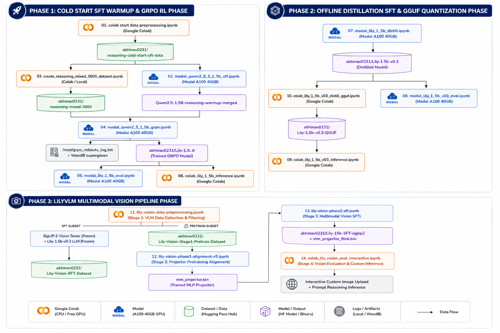

# Engineering Frontier AI (2026): From Foundation Models to Multimodal AI

> **A Comprehensive Hands-On Framework for Building, Distilling, Training, and Quantizing Reasoning LLMs and Multimodal Vision-Language Models (VLMs)**

---

## 💻 Quickstart & Cloning

To clone this repository and set up your local workspace, run:

```bash
# Clone the repository
git clone https://github.com/theabhinav0231/Engineering-Frontier-AI-Workshop.git

# Navigate into the project directory
cd Engineering-Frontier-AI-Workshop
```

---

## 🌟 Executive Overview

Welcome to the **Engineering Frontier AI Workshop Repository**. This codebase provides a complete, production-grade technical implementation for training state-of-the-art **Reasoning Large Language Models (LLMs)** and **Multimodal Vision-Language Models (VLMs)** from scratch.

Using modern deep learning infrastructure (**Modal A100/L4 Cloud Serverless**, **Google Colab**, **Unsloth**, **TRL**, **PyTorch**, and **llama.cpp**), this repository implements a 3-track training pipeline:

1. **Cold Start & GRPO Reinforcement Learning** (`Lily-1.5B`): SFT Warmup followed by Group Relative Policy Optimization (GRPO) using 4 custom verifiable reward functions.
2. **Teacher-Student Offline Distillation** (`Lily-1.5b-v0.3`): Distilling reasoning trajectories from a 105B teacher model (`Sarvam-105b-Distill-100k`) into a 1.5B student model with **2.4x sequence packing throughput**.
3. **Multimodal Vision Extension** (`Lily-Vision`): Connecting a SigLIP-2 vision encoder to Lily 1.5B via a 2-layer MLP bottleneck with 18x18 adaptive pooling downsampling, optimized via `LengthGroupedBatchSampler` (>8x acceleration).

---

## 📸 System Architecture & Pipeline



---

## 📚 Complete Notebook Sitemap (`workshop lab/`)

The core hands-on code is organized into 15 structured, fully annotated Jupyter Notebooks inside [`workshop lab/`](workshop%20lab/):

### Track 1: SFT Warmup & GRPO Reinforcement Learning
- 📄 **[`01_cold_start_data_preprocessing.ipynb`](workshop%20lab/01_cold_start_data_preprocessing.ipynb)** — Preprocesses OpenThoughts & Sky-T1 cold-start datasets, formatting CoT reasoning into ChatML `<think>` / `<answer>` structure.
- 📄 **[`02_modal_qwen_2_5_1_5b_sft.ipynb`](workshop%20lab/02_modal_qwen_2_5_1_5b_sft.ipynb)** — Executes QLoRA 4-bit SFT warmup on Qwen2.5-1.5B-Instruct across all 7 linear projection layers on Modal A100.
- 📄 **[`03_create_reasoning_mixed_3600_dataset.ipynb`](workshop%20lab/03_create_reasoning_mixed_3600_dataset.ipynb)** — Extracts 3,600 prompt samples across 7 diverse domains (`math_hard`, `openr1_math`, `gsm8k`, `arc_challenge`, `strategy_qa`, `alpaca`, `code`).
- 📄 **[`04_modal_qwen_2_5_1_5b_grpo.ipynb`](workshop%20lab/04_modal_qwen_2_5_1_5b_grpo.ipynb)** — Executes Group Relative Policy Optimization (GRPO) RL with 4 verifiable reward functions, DAPO loss clipping, and per-token KL divergence penalties.
- 📄 **[`05_modal_lily_1_5b_eval.ipynb`](workshop%20lab/05_modal_lily_1_5b_eval.ipynb)** — Runs `lm-evaluation-harness` across GSM8K, ARC-Challenge, and HellaSwag benchmarks.
- 📄 **[`06_colab_lily_1_5b_inference.ipynb`](workshop%20lab/06_colab_lily_1_5b_inference.ipynb)** — Interactive Colab inference notebook with regex `<think>` / `<answer>` tag parsing.

### Track 2: Teacher-Student Offline Distillation & Edge GGUF Quantization
- 📄 **[`07_modal_lily_1_5b_distill.ipynb`](workshop%20lab/07_modal_lily_1_5b_distill.ipynb)** — Distills Sarvam 105B teacher reasoning into Lily 1.5B with `packing=True` sequence packing, pushing final standalone model `Lily-1.5b-v0.3`.
- 📄 **[`08_modal_lily_1_5b_v03_eval.ipynb`](workshop%20lab/08_modal_lily_1_5b_v03_eval.ipynb)** — Comprehensive multi-benchmark evaluation suite (`gsm8k`, `arc_challenge`, `mmlu`, `mmlu_redux`, `hellaswag`, `ifeval`).
- 📄 **[`09_colab_lily_1_5b_v03_inference.ipynb`](workshop%20lab/09_colab_lily_1_5b_v03_inference.ipynb)** — Non-GGUF 16-bit inference notebook with programmatic schema compliance auditing.
- 📄 **[`10_colab_lily_1_5b_v03_distill_gguf.ipynb`](workshop%20lab/10_colab_lily_1_5b_v03_distill_gguf.ipynb)** — Converts `Lily-1.5b-v0.3` to GGUF format and runs `Q4_K_M`, `Q5_K_M`, and `Q8_0` K-quantizations via `llama.cpp`.

### Track 3: Multimodal Vision Extension (Lily Vision)
- 📄 **[`11_lily-vision-data-preprocessing.ipynb`](workshop%20lab/11_lily-vision-data-preprocessing.ipynb)** — Preprocesses 120k pretrain alignment pairs and 64k multimodal CoT samples (AI2D, ChartQA, DocVQA, OCR-VQA).
- 📄 **[`12_lily-vision-phase1-alignment-v5.ipynb`](workshop%20lab/12_lily-vision-phase1-alignment-v5.ipynb)** — Trains 2-layer MLP projector connecting SigLIP-2 vision encoder to Lily 1.5B LLM while keeping vision tower and LLM frozen.
- 📄 **[`13_lily-vision-phase2-sft.ipynb`](workshop%20lab/13_lily-vision-phase2-sft.ipynb)** — Fine-tunes LLM backbone via QLoRA + Projector using `LengthGroupedBatchSampler` (>8x speedup).
- 📄 **[`14_colab_lily_vision_eval_interactive.ipynb`](workshop%20lab/14_colab_lily_vision_eval_interactive.ipynb)** — Interactive Colab UI for visual question answering (VQA) with step-by-step reasoning.
- 📄 **[`15_colab_lily_vlm_gguf.ipynb`](workshop%20lab/15_colab_lily_vlm_gguf.ipynb)** — Exports `mmproj-model-f16.gguf` projector and quantized LLM backbone for edge VLM deployment.

---

## 📑 AI Training Handbook & Reference Manual

For a deep theoretical and practical walkthrough of PEFT/LoRA mathematics, hyperparameter scaling laws, GRPO loss equations, reward hacking mitigations, and cross-entropy loss theory, refer to the included handbook:

- 📖 **[`AI_Training_Handbook.pdf`](AI_Training_Handbook.pdf)** — Publication-ready PDF manual with KaTeX equations and architecture diagrams.
- 📝 **[`AI_Training_Handbook.md`](AI_Training_Handbook.md)** — Complete Markdown source document.

---

## ⚡ Key Technical Highlights

- **Lossless 16-Bit Merging**: Eliminates dual-path adapter latency by merging LoRA weights into base parameters prior to RL or distillation.
- **DAPO Asymmetric Loss Clipping**: Restricts policy gradient updates ($\epsilon_{\text{low}}=0.2, \epsilon_{\text{high}}=0.28$) during GRPO training to maintain policy stability.
- **5-Layer Reward Hacking Guard**: Neutralizes verbosity inflation via Schulman per-token KL divergence penalties ($\beta=0.001$), length guards, and multi-reward balancing.
- **FlashAttention-2 Sequence Packing**: Concatenates samples into fixed 4096-token arrays with block-diagonal attention masking, boosting throughput by **>2.4x**.
- **Length-Grouped Batching**: Minimizes padding overhead in multimodal VLM training, reducing SFT execution time from **3 hours to 20 minutes**.

---

## 📄 License

This repository is licensed under the [MIT License](LICENSE).
